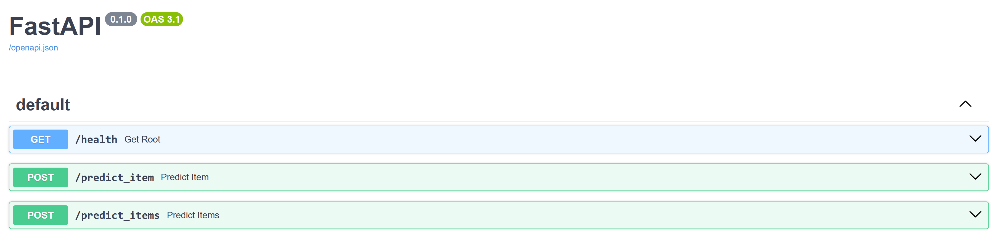
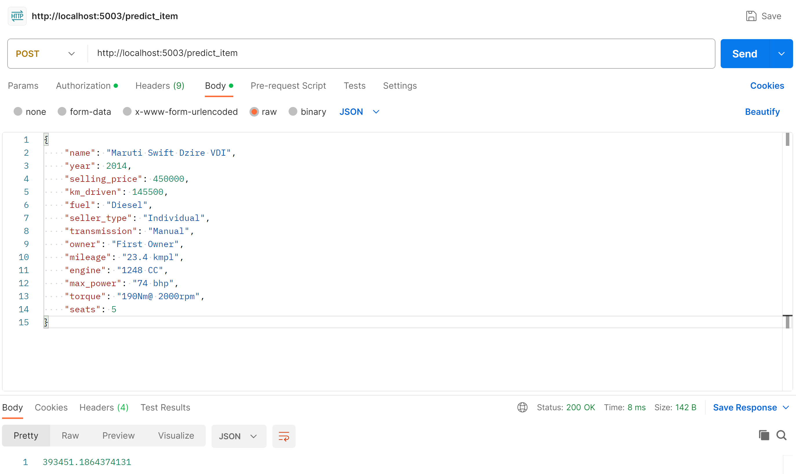
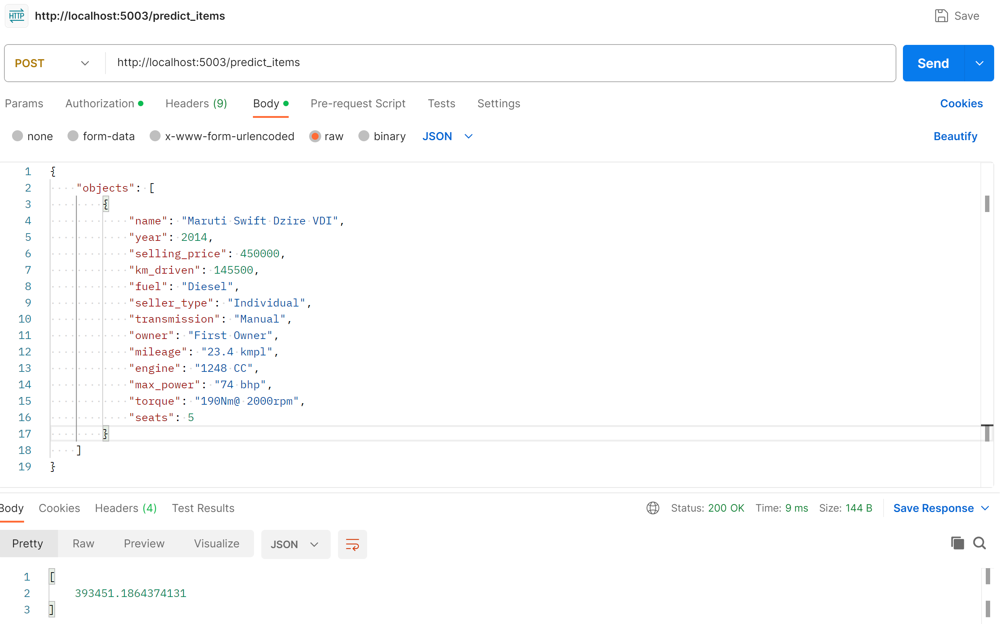

# МОВС 2023/24. Домашнее задание #1 
## Выполнил: Нарышев Денис

### Структура отчетных файлов
*HW1_Regression_with_inference.ipynb* - ноутбук с экспериментами</br>
*car_model.py* - файл с реализацией сервиса FastAPI</br>
*car_model_ridge.pickle* - файл с сохранёнными параметрами модели</br>
*README.md* - файл с выводами про проделанной вами работе</br>
**Cервис REST** - https://movs-dnaryshev-ml-hw1.onrender.com/docs

## Резюме проекта

### Что было сделано

Была постороена моя первая модель оценки стоимости автомобилей на базе линейной регрессии.
	
Были выполнены шаги
<ul>
  <li>Анализ и подготовка данных:
    <ul>
      <li>Получение исходных данных;</li>
      <li>Анализ структуры данных;</li>
      <li>Устранение дубликатов;</li>
      <li>Заполнение пропусков;</li>
    </ul>
  </li>
  <li>Разработка модели:
    <ul>
      <li>Апробация нескольких модификаций линейных регрессий - Linear, ElasticNet, Lasso, Ridge;</li>
      <li>Стандартизация параметров;</li>
      <li>Использование OneHotEncoder для кодирования категориальных переменных;</li>
    </ul>
  </li>
  <li>Оптимизация и выбор модели:
    <ul>
      <li>Изучение различных гиперпараметров для поиска оптимальной конфигурации модели логистической регрессии;</li>
    </ul>
  </li>
  <li>Сохранение модели:
    <ul>
      <li>Сериализовали окончательную модель с помощью модуля Pickle;</li>
    </ul>
  </li>
  <li>Интеграция с FastAPI:
    <ul>
      <li>Интегрировали модель в приложение FastAPI;</li>
    </ul>
  </li>
  <li>Достигнутые результаты:
    <ul>
      <li>Построена модель логистической регрессии ridge-model, дающая точность R^2=0.622 на трейне и R^2=0.645 на тесте;</li>
      <li>Модель была успешно развернута в среде FastAPI.</li>
    </ul>
  </li>
</ul>
</br>

**Проблемы и уроки**</br>
Основной сложностью для меня было то, что это первая модель которую я обучал. Поэтому сложно было понять, как корректно применить некоторые мтеоды из смежных библиотек для получения результатов. Также, у меня не хватило времени на то, чтобы погрузиться в самую интересную часть 4 Feature Engineering - думаю, что вернусь к этому позже. 


**API сервиса**


**Пример предсказания цены для одного автомобиля**


**Пример предсказания цены для массива автомобилей**


**Пример** POST https://movs-dnaryshev-ml-hw1.onrender.com/predict_item 
```
{
    "name": "Maruti Swift Dzire VDI",
    "year": 2014,
    "selling_price": 450000,
    "km_driven": 145500,
    "fuel": "Diesel",
    "seller_type": "Individual",
    "transmission": "Manual",
    "owner": "First Owner",
    "mileage": "23.4 kmpl",
    "engine": "1248 CC",
    "max_power": "74 bhp",
    "torque": "190Nm@ 2000rpm",
    "seats": 5
}
```
